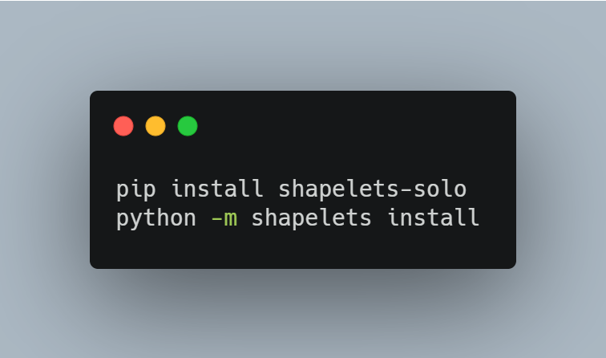
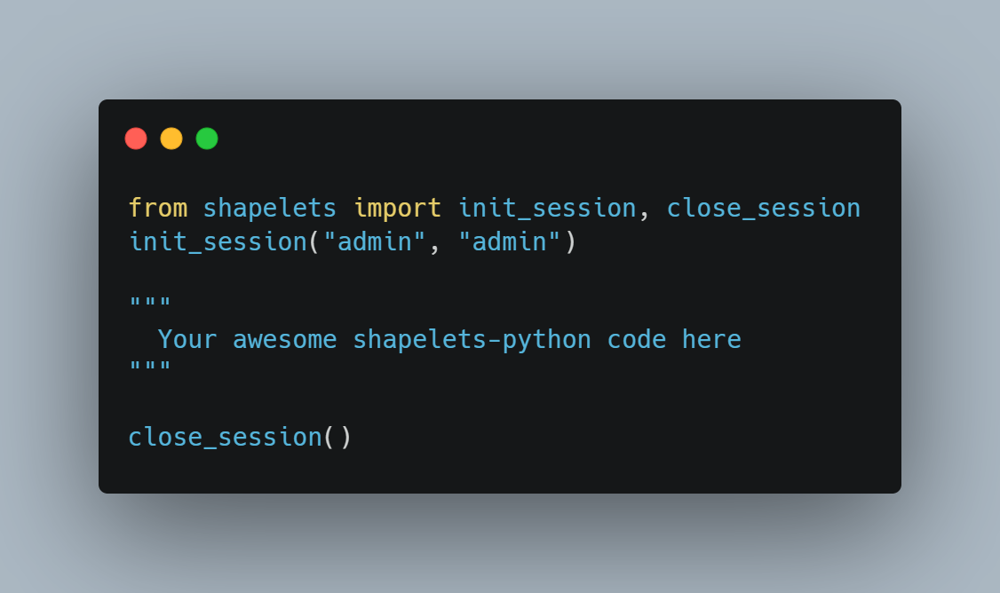
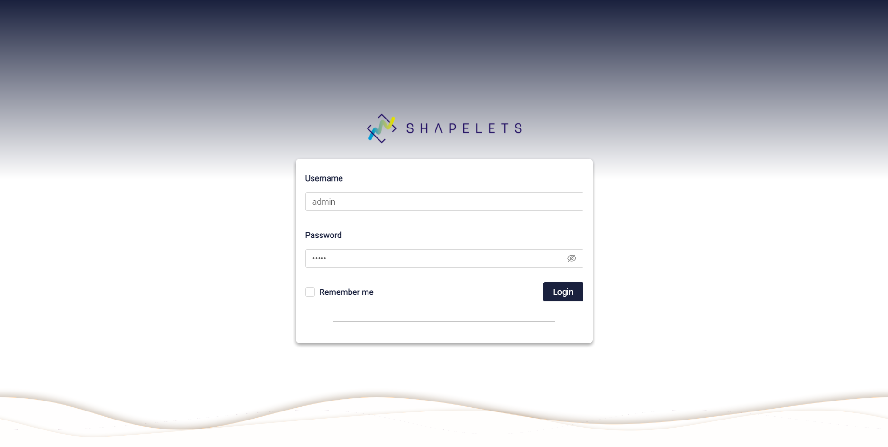

# shapelets-examples

A set of running data-apps examples for Shapelets platform.

## Requirements

This package requires the python package shapelets-solo, [Java OpenJDK](https://builds.openlogic.com/downloadJDK/openlogic-openjdk/8u292-b10/openlogic-openjdk-8u292-b10-windows-x64.msi) and [Visual C++ Redistributables](https://support.microsoft.com/en-us/topic/the-latest-supported-visual-c-downloads-2647da03-1eea-4433-9aff-95f26a218cc0) to be installed before running the examples. You can find detailed installation instructions in our [Wiki](https://github.com/shapelets/shapelets-solo-examples/wiki/Installation).

```shell
pip install shapelets-solo
python -m shapelets install
```



## Run

After the installation, you can run the application by typing `python -m shapelets start` from a terminal or by running the script below in a python file or python cli.

```python
from shapelets import init_session
init_session("admin", "admin")
```



Above lines start a background process running the shapelets-server in https://localhost by default and starts a session as admin.

## GUI

Shapelets brings a built-in web application, named **Cristal-UI**. After starting shapelets from the CLI or the init*session, the web application is available at https://localhost. Once the server is up and running, you could go to your favourite browser and login into the web applications with _admin_ as user and _admin_ as password.



## CLI commands

| command | description                                   |
| ------- | --------------------------------------------- |
| install | Installs required 3rd party libs              |
| start   | Starts a Shapelets process                    |
| status  | Reports the status of the system              |
| stop    | Stops a Shapelets process by pid              |
| tail    | Tails the logs for a Shapelets process by pid |

All these commands accept `--help` flag also.
